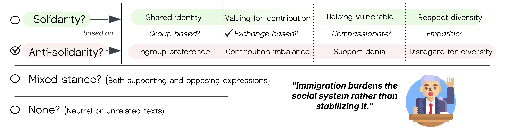

[](https://www.python.org/)
[](./LICENSE)

# LLM Analysis of German Parliamentary Debates

Data and code for the paper ["LLM Analysis of 150+ years of German Parliamentary Debates on Migration Reveals Shift from Post-War Solidarity to Anti-Solidarity in the Last Decade"](https://arxiv.org/abs/2509.07274) by Aida Kostikova, Ole Pütz, Steffen Eger, Olga Sabelfeld, and Benjamin Paassen.

<p align="center">
  
</p>

This repository extends the resources introduced in ["Fine-Grained Detection of Solidarity for Women and Migrants in 155 Years of German Parliamentary Debates"](https://aclanthology.org/2024.emnlp-main.337/) by Aida Kostikova, Dominik Beese, Benjamin Paassen, Ole Pütz, Gregor Wiedemann, and Steffen Eger (EMNLP 2024). The original repository is available at [DominikBeese/FairGer](https://github.com/DominikBeese/FairGer).

## Content

Compared with [DominikBeese/FairGer](https://github.com/DominikBeese/FairGer), this repository adds:

- 📂 [Data](./Data)
  - 📂 [Datasets](./Data/Datasets): source datasets extended from 2022 to June 2025
  - 📂 [HumanAnnotatedDataset](./Data/HumanAnnotatedDataset): human-annotated benchmark data, now including all annotators' labels for the original benchmark and a new extension dataset
  - 📂 [ModelPredictedData](./Data/ModelPredictedData): model-predicted labels for the full dataset from three open models (`gpt-oss-120b`, `Llama-3.3-70b`, `Qwen-2.5-72b`)
- 📂 [ExperimentsScripts](./ExperimentsScripts): scripts for the expanded set of training and inference experiments
- 📂 [Analysis](./Analysis): scripts and notebooks for multi-label extension of DSL ([Egami et al., 2023](https://proceedings.neurips.cc/paper_files/paper/2023/hash/d862f7f5445255090de13b825b880d59-Abstract-Conference.html)) and solidarity trend analysis

Large JSON files are stored in compressed `.json.gz` format to stay within GitHub file-size limits:
- [Data/ModelPredictedData/Migrant_1867-2025_AllModels.json.gz](./Data/ModelPredictedData/Migrant_1867-2025_AllModels.json.gz)
- [Data/Datasets/Frau_1867-2025.json.gz](./Data/Datasets/Frau_1867-2025.json.gz)
Decompress with `gunzip <filename>.json.gz`.

See [DominikBeese/DeuParl-v2](https://github.com/DominikBeese/DeuParl-v2) for the dataset of plenary protocols from the German _Reichstag_ and _Bundestag_.

## License

Unless otherwise noted, the code and documentation in this repository are licensed under the Creative Commons Attribution 4.0 International License (CC BY 4.0).

Materials in [`Data/HumanAnnotatedDataset/`](./Data/HumanAnnotatedDataset/) are subject to separate terms described in that folder’s [`README.md`](./Data/HumanAnnotatedDataset/README.md) and [`LICENSE`](./Data/HumanAnnotatedDataset/LICENSE) files.

## Citation

```bibtex
@article{kostikova2025llm,
  title={LLM Analysis of 150+ years of German Parliamentary Debates on Migration Reveals Shift from Post-War Solidarity to Anti-Solidarity in the Last Decade},
  author={Kostikova, Aida and P{\"u}tz, Ole and Eger, Steffen and Sabelfeld, Olga and Paassen, Benjamin},
  journal={arXiv preprint arXiv:2509.07274},
  year={2025}
}
```
> **Abstract:** Migration has been a core topic in German political debate, from the postwar displacement of millions of expellees to labor migration and recent refugee movements. Studying political speech across such wide-ranging phenomena in depth has traditionally required extensive manual annotation, limiting analysis to small subsets of the data. Large language models (LLMs) offer a potential way to overcome this constraint. Using a theory-driven annotation scheme, we examine how well LLMs annotate subtypes of solidarity and anti-solidarity in German parliamentary debates and whether the resulting labels support valid downstream inference. We first provide a comprehensive evaluation of multiple LLMs, analyzing the effects of model size, prompting strategies, fine-tuning, historical versus contemporary data, and systematic error patterns. We find that the strongest models, especially GPT-5 and gpt-oss-120B, achieve human-level agreement on this task, although their errors remain systematic and bias downstream results. To address this issue, we combine soft-label model outputs with Design-based Supervised Learning (DSL) to reduce bias in long-term trend estimates. Beyond the methodological evaluation, we interpret the resulting annotations from a social-scientific perspective to trace trends in solidarity and anti-solidarity toward migrants in postwar and contemporary Germany. Our approach shows relatively high levels of solidarity in the postwar period, especially in group-based and compassionate forms, and a marked rise in anti-solidarity since 2015, framed through exclusion, undeservingness, and resource burden. We argue that LLMs can support large-scale social-scientific text analysis, but only when their outputs are rigorously validated and statistically corrected.
